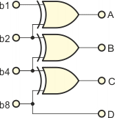

:raised_hand: Cześć, nazywam się **Jan M.** i jestem studentem pierwszego roku na kierunku **Informatyka i Systemy Inteligentne**.
Interesuję się:

- Sportem:
  - Siatkówka
  - Skoki narciarskie
  - Piłka ręczna

- Programowaniem

- Elektroniką cyfrową:

  <picture align="top">
  
  </picture>
- Mikroprocesorami
- Systemami Alarmowymi
- 
Moja [Strona Internetowa:](https://archiray1.github.io/)

Mieszkam na _**Podkarpaciu**_, w powiecie _**brzozowskim**_. Skończyłem *Technikum nr 5 w Krośnie*, posiadam zawód ***Technik Elektronik***

